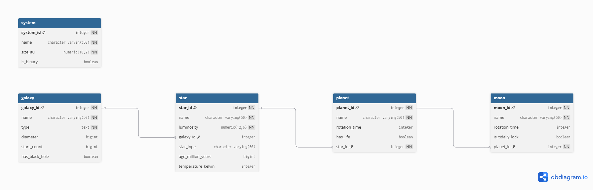

# 🌌 Universe Database

A relational database modeling galaxies, stars, planets, and moons using PostgreSQL.

## 📌 Overview

This project was developed as part of the **freeCodeCamp Relational Database Certification**.

It represents a hierarchical structure of the universe:

* Galaxies contain stars
* Stars contain planets
* Planets contain moons

## 🧠 Database Structure

* **Galaxy**
* **Star**
* **Planet**
* **Moon**
* **System** (independent entity)

## 🔗 Relationships

* Galaxy → Star (1:N)
* Star → Planet (1:N)
* Planet → Moon (1:N)

## 🛠️ Technologies

* PostgreSQL
* SQL

## 📊 Entity Relationship Diagram



## 🚀 How to Run

```bash
psql -U your_user -d your_db -f schema.sql
```

## 📌 Example Queries

```sql
-- Get all moons of Mars
SELECT m.name
FROM moon m
JOIN planet p ON m.planet_id = p.planet_id
WHERE p.name = 'Mars';
```

## 💡 Future Improvements

* Connect `system` to stars
* Add more astronomical data
* Build an API (Flask/Django)

## 👨‍💻 Author

Luis Fernando Faria Delmondes
